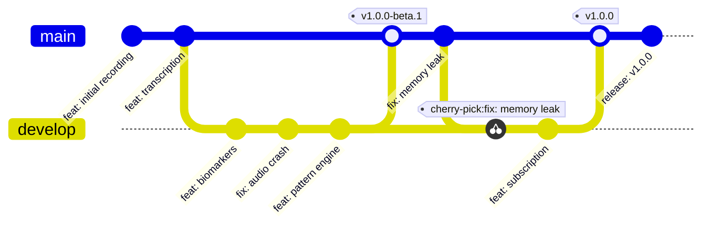

# Soulo — CI/CD Pipeline

## 1. Pipeline Overview

```
Git Push
   ↓
GitHub Actions
   ├── lint        (SwiftLint, format check)
   ├── test        (Unit tests, integration tests)
   ├── build       (Release build)
   ├── upload      (TestFlight / App Store)
   └── notify      (Slack/Discord)
```

## 2. GitHub Actions Workflow

```yaml
name: CI/CD

on:
  push:
    branches: [main, develop]
  pull_request:
    branches: [main]

env:
  PROJECT_NAME: Soulo
  SCHEME: Soulo
  DEVELOPER_DIR: /Applications/Xcode.app/Contents/Developer

jobs:
  lint:
    runs-on: macos-15
    steps:
      - uses: actions/checkout@v4
      - name: SwiftLint
        run: swiftlint --strict
        
  unit-test:
    needs: lint
    runs-on: macos-15
    strategy:
      matrix:
        destination:
          - 'platform=iOS Simulator,name=iPhone 16 Pro,OS=18.0'
          - 'platform=iOS Simulator,name=iPhone 14,OS=17.0'
    steps:
      - uses: actions/checkout@v4
      - name: Download test models
        run: |
          # Download small test models (not full 2.4GB)
          curl -L -o Tests/Models/test-model.bin https://storage.voiceself.app/test-model.bin
      - name: Run Unit Tests
        run: |
          xcodebuild test \
            -project "$PROJECT_NAME.xcodeproj" \
            -scheme "$SCHEME" \
            -destination "${{ matrix.destination }}" \
            -resultBundlePath "TestResults/${{ matrix.destination }}" \
            CODE_SIGN_IDENTITY="" CODE_SIGNING_REQUIRED=NO
      - name: Upload test results
        uses: actions/upload-artifact@v4
        with:
          name: test-results-${{ matrix.destination }}
          path: TestResults/
        if: always()

  integration-test:
    needs: lint
    runs-on: macos-15
    steps:
      - uses: actions/checkout@v4
      - name: Run Integration Tests
        run: |
          xcodebuild test \
            -project "$PROJECT_NAME.xcodeproj" \
            -scheme "${SCHEME}IntegrationTests" \
            -destination 'platform=iOS Simulator,name=iPhone 16 Pro,OS=18.0' \
            CODE_SIGN_IDENTITY="" CODE_SIGNING_REQUIRED=NO

  build:
    needs: [unit-test, integration-test]
    if: github.ref == 'refs/heads/main'
    runs-on: macos-15
    steps:
      - uses: actions/checkout@v4
      - name: Install Apple certificates
        uses: apple-actions/import-codesign-certs@v3
        with:
          p12-file-base64: ${{ secrets.CERTIFICATES_P12 }}
          p12-password: ${{ secrets.CERTIFICATES_P12_PASSWORD }}
      - name: Install provisioning profile
        run: |
          echo "${{ secrets.PROVISIONING_PROFILE }}" | base64 --decode > ~/Library/MobileDevice/Provisioning\ Profiles/Soulo.mobileprovision
      - name: Build
        run: |
          xcodebuild clean archive \
            -project "$PROJECT_NAME.xcodeproj" \
            -scheme "$SCHEME" \
            -archivePath "build/$PROJECT_NAME.xcarchive" \
            -configuration Release \
            CODE_SIGN_STYLE=Manual \
            PROVISIONING_PROFILE_SPECIFIER="Soulo App Store"
      - name: Export IPA
        run: |
          xcodebuild -exportArchive \
            -archivePath "build/$PROJECT_NAME.xcarchive" \
            -exportPath "build/" \
            -exportOptionsPlist ExportOptions.plist
      - name: Upload IPA
        uses: actions/upload-artifact@v4
        with:
          name: app-ipa
          path: build/*.ipa

  deploy-testflight:
    needs: build
    if: github.ref == 'refs/heads/main'
    runs-on: macos-15
    steps:
      - uses: actions/checkout@v4
      - name: Download IPA
        uses: actions/download-artifact@v4
        with:
          name: app-ipa
      - name: Upload to TestFlight
        uses: apple-actions/upload-testflight-build@v3
        with:
          ipa-path: build/*.ipa
          api-key-id: ${{ secrets.APP_STORE_API_KEY_ID }}
          api-issuer-id: ${{ secrets.APP_STORE_API_ISSUER_ID }}
          api-private-key: ${{ secrets.APP_STORE_API_PRIVATE_KEY }}

  deploy-appstore:
    needs: [build, deploy-testflight]
    if: github.ref == 'refs/heads/main' && contains(github.event.head_commit.message, 'release:')
    runs-on: macos-15
    steps:
      - uses: actions/checkout@v4
      - name: Upload to App Store
        uses: apple-actions/upload-app-store-build@v3
        with:
          ipa-path: build/*.ipa
          api-key-id: ${{ secrets.APP_STORE_API_KEY_ID }}
          api-issuer-id: ${{ secrets.APP_STORE_API_ISSUER_ID }}
          api-private-key: ${{ secrets.APP_STORE_API_PRIVATE_KEY }}
          submit-for-review: true
```

## 3. Export Options Plist

```xml
<?xml version="1.0" encoding="UTF-8"?>
<!DOCTYPE plist PUBLIC "-//Apple//DTD PLIST 1.0//EN" "http://www.apple.com/DTDs/PropertyList-1.0.dtd">
<plist version="1.0">
<dict>
    <key>method</key>
    <string>app-store</string>
    <key>teamID</key>
    <string>TEAM_ID_HERE</string>
    <key>uploadBitcode</key>
    <false/>
    <key>uploadSymbols</key>
    <true/>
    <key>compileBitcode</key>
    <true/>
    <key>destination</key>
    <string>upload</string>
    <key>generateAppStoreInformation</key>
    <true/>
</dict>
</plist>
```

## 4. Required Secrets

| Secret | Purpose | Source |
|---|---|---|
| `CERTIFICATES_P12` | Code signing certificate | Apple Developer |
| `CERTIFICATES_P12_PASSWORD` | Certificate password | Apple Developer |
| `PROVISIONING_PROFILE` | Distribution profile | Apple Developer |
| `APP_STORE_API_KEY_ID` | API key ID | App Store Connect |
| `APP_STORE_API_ISSUER_ID` | API issuer ID | App Store Connect |
| `APP_STORE_API_PRIVATE_KEY` | API private key (.p8) | App Store Connect |

## 5. Versioning & Build Numbers

```bash
#!/bin/bash
# bump_version.sh — called by CI

VERSION=$(git describe --tags --abbrev=0 2>/dev/null || echo "1.0.0")
BUILD=$(git rev-list --count HEAD)

# Extract major.minor.patch
MAJOR=$(echo $VERSION | cut -d. -f1)
MINOR=$(echo $VERSION | cut -d. -f2)
PATCH=$(echo $VERSION | cut -d. -f3)

# Update plist
/usr/libexec/PlistBuddy -c "Set :CFBundleShortVersionString $MAJOR.$MINOR.$PATCH" Soulo/Info.plist
/usr/libexec/PlistBuddy -c "Set :CFBundleVersion $BUILD" Soulo/Info.plist

echo "Version: $MAJOR.$MINOR.$PATCH ($BUILD)"
```

## 6. Release Workflow



### Release Types

| Tag | Destination | Notes |
|---|---|---|
| `v1.0.0-beta.1` | TestFlight internal | Friends & family |
| `v1.0.0-rc.1` | TestFlight external | Closed beta |
| `v1.0.0` | App Store | Public release |
| `v1.0.1` | App Store | Hotfix |

## 7. Pre-Launch Checklist (CI Check)

- [ ] All tests pass (unit + integration)
- [ ] SwiftLint: zero warnings
- [ ] Performance budget met (memory, battery, storage)
- [ ] Database migration path from previous versions
- [ ] App Store metadata updated
- [ ] Privacy policy link valid
- [ ] Subscription products active in App Store Connect
- [ ] Crash reporting verified (opt-in)
- [ ] Backup/restore tested end-to-end
- [ ] iCloud entitlement configured
